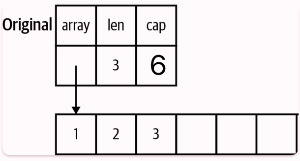
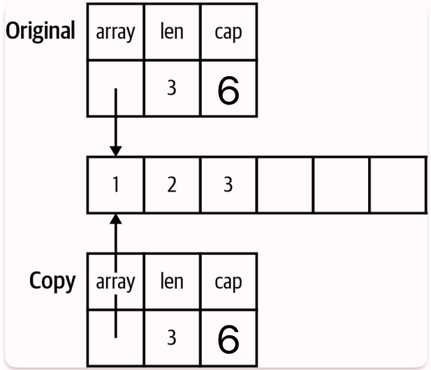
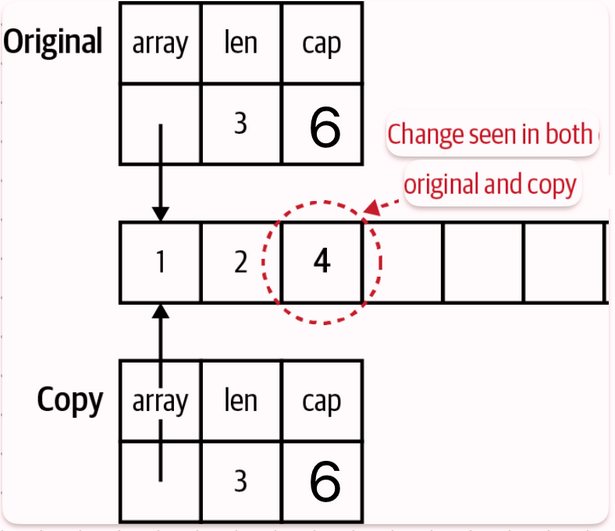
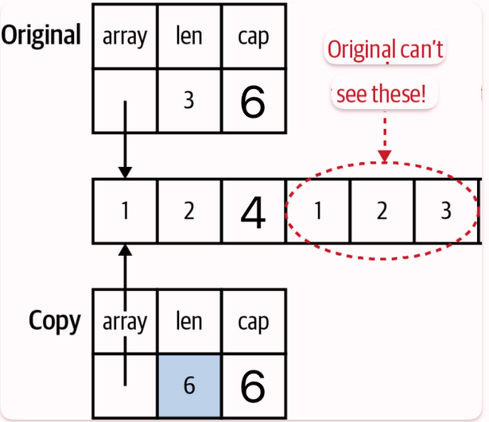
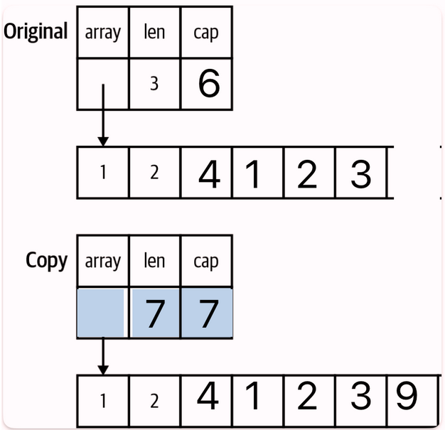

# Pointers

## A Quick Pointer Primer
A pointer is a variable that holds the location in memory where a value is stored. A simple visual representation of how the following two variables are stored in memory would look something like this:
```go
var x int32 = 10
var y bool = true
```


Every variable is stored in one or more contiguous memory locations, called addresses. Different types of variables take up different amounts of memory. A 32-bit `int` requires 4 bytes, a boolean only requires a single byte(you only need a bit to represent true or false, but the smallest amount of memory that can be independently addressed is a byte).

A pointer is variable whose value is the address where another variable is stored in memory:
```go
var x int32 = 10
var y bool = true
pointerX := &x
pointerY := &y
var pointerZ *string
```


Every pointer, no matter what type it is pointing to, always takes up the same number of memory locations. Our examples use 4 byte pointers, but many modern computers use 8 bytes for pointers. A pointer holds a number that indicates the location in memory where the data being pointed to is stored, also known as the *address*.

`pointerX`, is stored at location 6 and has the value 1, the address of `x`. Similarly, `pointerY` is stored at location 10 and has the value 5, the address of `y`.

The zero value for a pointer is `nil`, we've seen `nil` a few times before as the zero value for slices, maps, and functions. All of these types are implemented with pointers(Two more types, channels and interfaces, are also implemented with pointers).

The `&` is the *address* operator. It precedes a value type and returns the address where the value is stored:
```go
x := "hello"
pointerToX := &x
```
The `*` is the *indirection* operator. It precedes a variable of pointer type and returns the pointed-to value. This is called *dereferencing*:
```go
x := 10
pointerToX := &x
fmt.Println(pointerToX) // prints a memory address
fmt.Println(&pointerToX) // 10
z := 5 + *pointerToX
fmt.Println(z) // 15
```
Before dereferencing a pointer, make sure that the pointer is non-nil. Your program will panic if you attempt to dereference a `nil` pointer.

A *pointer type* is a type that represents a pointer. It is written with a `*` before a type name:
```go
x := 10
var pointerToX *int
pointerToX = &x
```
You can't use `&` before a primitive literal(numbers, booleans, and strings) or a constant because they don't have memory addresses; they only exist at compile time. When you need a pointer to a primitive type, declare a variable and point to it.

If you have a struct with a field of a pointer type, you can't assign a literal directly to the field: 
```go
type person struct {
  FirstName  string
  MiddleName *string
  LastName   string
}

p := person{
  FirstName:  "Pat",
  MiddleName: "Perry", // cannot use "Perry" (untyped string constant) as *string value in struct literal 
  LastName:   "Peterson",
}
```
If you try to put an `&` before `"Perry"`, you'll get the following error:
```
invalid operation: cannot take address of "Perry" (untyped string constant)
```
There are two ways to handle this. You can do what we've seen previously, which is introduce a variable to hold the constant value. The second is to create a generic helper function that takes in a parameter of any type and returns a pointer to that type:
```go
func makePointer[T any](t T) *T {
	return &t
}
```
We can use this function like so:
```go
p := person{
  FirstName:  "Pat",
  MiddleName: makePointer("Perry"),
  LastName:   "Peterson",
}
```
When you pass a constant to a function, the constant is copied to a parameter, which is a variable. Since it's a variable, it has an address in memory which we return. We'll cover generics in [section 8](./08_generics.md).

## Pointers Indicate Mutable Parameters
Instead of declaring that some variables and parameters are immutable, Go developers use pointers to indicate that a parameter is mutable.

Since Go is a call be value language, the values passed to functions are copies. For non-pointer types like primitives, structs, and arrays, this means that the called function cannot modify the original. Since the called function has a copy of the original data, the original data's immutability is guaranteed.

However, if a pointer is passed to a function, the function gets a copy of the pointer. This still points to the original data, which means that the original data can be modified by the calling function. This has a couple of related implications.

First is that when you pass a `nil` pointer to a function, you cannot make it non-nil. You can only reassign the value if there was a value already assigned to the pointer. Since the memory location was passed to the function via call-by-value, you can't change the memory address, any more than you could change the value of an `int` parameter:
```go
func failedUpdate(g *int) {
	x := 10
	g = &x
}

func main() {
	var f *int // f is nil
	failedUpdate(f)
	fmt.Println(f) // nil
}
```
Here is a diagram of how this code flows:


The second implication of copying a pointer is that if you want the value assigned to a pointer parameter to still be there when you exit the function, you must dereference the pointer and set the value. If you change the pointer, you have changed the copy not the original. Dereferencing puts a new value in the memory location pointed to by both the original and the copy:
```go
func failedUpdate(px *int) {
	x2 := 20
	px = &x2
}

func update(px *int) {
	*px = 20
}

func main() {
	x := 10
	failedUpdate(&x)
	fmt.Println(x) // 10
	update(&x)
	fmt.Println(x) // 20
}
```
Here is how this code flows visually:


## Pointers Are a Last Resort
You should be careful when using pointers, they can make it harder to understand data flow and can create extra work for the garbage collector. As an example, don't populate a struct by passing a pointer to it into a function, instead have the function instantiate and return the struct: 
```go
// Don't do this
func MakeFoo(f *Foo) error {
	f.Field1 = "val"
	f.Field2 = 20
	return nil
}

// Do this
func MakeFooV2() (Foo, error) {
	f := Foo{
		Field1: "val",
		Field2: 20,
	}
	return f, nil
}
```
The only time you should use pointer parameters to modify a variable is when the function expects an interface. This is a common pattern when working with JSON:
```go
	f := struct {
		Name string `json:"name"`
		Age  int    `json:"age"`
	}{}
	err := json.Unmarshal([]byte(`{"name": "Bob", "age": 30}`), &f)
```
When returning values from a function, you should favor value types. Only use a pointer type as a return type if there is state within the data type that needs to be modified.

## The Zero Value Versus No Value
A common usage of pointers in Go is to indicate the difference between a variable or field that's been assigned the zero value and a variable or field that hasn't been assigned a value at all.

However, because pointers also indicate mutability, be careful when using this pattern. It can often be better to use the comma ok idiom and return a value type and a boolean instead.

While a pointer does provide a handy way to indicate no value, if you are not going to modify the value, you should use a value type paired with a boolean instead.

## The Difference Between Maps and Slices
We see in the previous section that any modifications made to a map that's passed to a function are reflected in the original variable that was passed in. This is because within the Go runtime maps are implemented as a pointer to a struct.

Because of this we should be careful about using maps for input parameters or return values, especially on public APIs. Maps are often a bad choice because there's nothing that explicitly defines what keys are in the map, so the only way to know what they are is to trace through your code. Rather than passing a map around it's often better to use a struct.

> **_NOTE:_** There are situations where a map input parameter or return value makes sense. A struct requires you to name its fields at compile time. If they keys for your data aren't know at compile time, a map can work.

With slices, we saw that we can modify its contents but we can't use `append` to change the length of the original variable, even if the slice has a capacity greater than its length. This is because a slice is implemented as a struct with three fields: an `int` field for length, `int` field for capacity, and a pointer to a block of memory.



When a slice is copied to a different variable or passed to a function, a copy is made of the length, capacity, and the pointer:



Changing the values in the slice changes the memory that the pointer points to, so the changes are seen in both the copy and the original:



If the slice copy is appended to and there is enough capacity in the slice for the new values, the length changes in the copy and the new values are stored in the shared block of memory. However, the length in the original slice remains unchanged. This means the Go runtime prevents the original slice from seeing those values:



If the slice copy is appended to and there isn't enough capacity a new bigger block of memory is allocated, values are copied over, and the pointer, length, and capacity fields in the copy are updated. Now each slice variable points to a different memory block:



As the main linear data structure in Go, slice are frequently passed around. By default, you should assume that a slice is not modified by a function. Your function's documentation should specify if it modifies the slice's contents.

> **_NOTE:_** The reason you can pass a slice of any size to a function is that the data type that's passed to the function is the same size for any slice: a struct of two `int` values and a pointer.

## Slices as Buffers
When reading data from an external resource(file, network connection, etc.) many languages use code like this:
```
r = open_resource()
while r.has_data() {
  data_chunk = r.next_chunk()
  process(data_chunk)
}
close(r)
```
The problem with this pattern is that every time you iterate through the `while` loop, you allocate another `data_chunk` even though each one is only used once. This creates lots of unnecessary memory allocations which means more work for the garbage collector.

Writing idiomatic Go means avoiding unneeded allocations, so instead of returning a new allocation each time you read from a data source you can create a slice of bytes and use it as a buffer:
```go
file, err := os.Open(fileName)
if err != nil {
  return err
}
defer file.Close()
data := make([]byte, 100)
for {
  count, err := file.Read(data)
  process(data[:count])
  if err != nil {
    if errors.Is(err, io.EOF) {
      return nil
    }
    return err
  }
}
```
In this code we create a buffer of 100 bytes and each time through the loop we copy the next block of bytes(up to 100) into the slice so that it can be processed.

## Reducing the Garbage Collector's Workload
When programmers talk about "garbage" they are referring to data that has no more pointers pointing to it. Once this happens, the memory that data takes up can be reused. If the memory isn't recovered the program's memory usage would continue to grow until the computer runs out of RAM. The job of the garbage collector is to automatically detect unused memory and recover it so it can be reused.

A stack is a consecutive block of memory. Every function call in a thread shares the same stack. Allocating memory on the stack is fast and simple. A *stack pointer* tracks the last location where memory was allocated. Allocating additional memory is done by changing the value of the stack pointer. When a function is invoked, a new *stack frame* is created for the function's data. Local variables are stored on the stack, along with parameters passed into the function. Each new variables makes the stock pointer by the size of the value. When a function exits, it return values are copied back to the calling function and the stack pointer is moved back to the beginning of the stack frame for the exited function, deallocating all of the stack memory that was used by the function's local variables and parameters.

To store something on the stack you must know exactly how big it is at compile time. The value types in Go(primitive values, arrays, and structs) all have known sizes at compile time, meaning they can be stored on the stack instead of the heap. The size of a pointer type is also known and can be stored on the stack.

The rules are more complicated when it comes to the data that the pointer points to. In order to allocate the data the pointer points to on the stack, several conditions must be true:
- It must be a local variable whose data size is known at compile time. 
- The pointer cannot be returned from the function.
- If the pointer is passed into a function, the compiler must be able to ensure that these conditions still hold.

<!--TODO: Add addendum about pointers and escape analysis, will be stored in a separate file -->

## Tuning the Garbage Collector

## Exercises

## Wrapping Up
