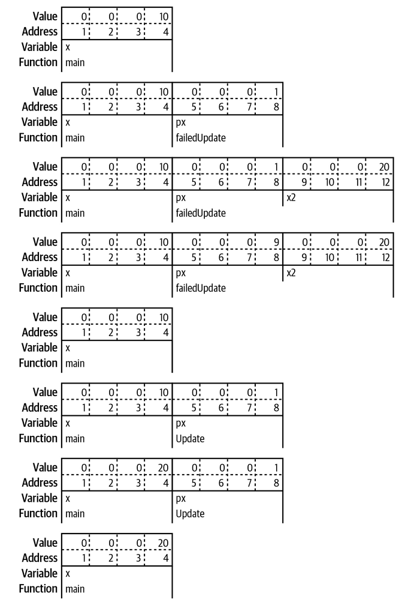

# Pointers

## A Quick Pointer Primer
A pointer is a variable that holds the location in memory where a value is stored. A simple visual representation of how the following two variables are stored in memory would look something like this:
```go
var x int32 = 10
var y bool = true
```


Every variable is stored in one or more contiguous memory locations, called addresses. Different types of variables take up different amounts of memory. A 32-bit `int` requires 4 bytes, a boolean only requires a single byte(you only need a bit to represent true or false, but the smallest amount of memory that can be independently addressed is a byte).

A pointer is variable whose value is the address where another variable is stored in memory:
```go
var x int32 = 10
var y bool = true
pointerX := &x
pointerY := &y
var pointerZ *string
```


Every pointer, no matter what type it is pointing to, always takes up the same number of memory locations. Our examples use 4 byte pointers, but many modern computers use 8 bytes for pointers. A pointer holds a number that indicates the location in memory where the data being pointed to is stored, also known as the *address*.

`pointerX`, is stored at location 6 and has the value 1, the address of `x`. Similarly, `pointerY` is stored at location 10 and has the value 5, the address of `y`.

The zero value for a pointer is `nil`, we've seen `nil` a few times before as the zero value for slices, maps, and functions. All of these types are implemented with pointers(Two more types, channels and interfaces, are also implemented with pointers).

The `&` is the *address* operator. It precedes a value type and returns the address where the value is stored:
```go
x := "hello"
pointerToX := &x
```
The `*` is the *indirection* operator. It precedes a variable of pointer type and returns the pointed-to value. This is called *dereferencing*:
```go
x := 10
pointerToX := &x
fmt.Println(pointerToX) // prints a memory address
fmt.Println(&pointerToX) // 10
z := 5 + *pointerToX
fmt.Println(z) // 15
```
Before dereferencing a pointer, make sure that the pointer is non-nil. Your program will panic if you attempt to dereference a `nil` pointer.

A *pointer type* is a type that represents a pointer. It is written with a `*` before a type name:
```go
x := 10
var pointerToX *int
pointerToX = &x
```
You can't use `&` before a primitive literal(numbers, booleans, and strings) or a constant because they don't have memory addresses; they only exist at compile time. When you need a pointer to a primitive type, declare a variable and point to it.

If you have a struct with a field of a pointer type, you can't assign a literal directly to the field: 
```go
type person struct {
  FirstName  string
  MiddleName *string
  LastName   string
}

p := person{
  FirstName:  "Pat",
  MiddleName: "Perry", // cannot use "Perry" (untyped string constant) as *string value in struct literal 
  LastName:   "Peterson",
}
```
If you try to put an `&` before `"Perry"`, you'll get the following error:
```
invalid operation: cannot take address of "Perry" (untyped string constant)
```
There are two ways to handle this. You can do what we've seen previously, which is introduce a variable to hold the constant value. The second is to create a generic helper function that takes in a parameter of any type and returns a pointer to that type:
```go
func makePointer[T any](t T) *T {
	return &t
}
```
We can use this function like so:
```go
p := person{
  FirstName:  "Pat",
  MiddleName: makePointer("Perry"),
  LastName:   "Peterson",
}
```
When you pass a constant to a function, the constant is copied to a parameter, which is a variable. Since it's a variable, it has an address in memory which we return. We'll cover generics in [section 8](./08_generics.md).

## Pointers Indicate Mutable Parameters
Instead of declaring that some variables and parameters are immutable, Go developers use pointers to indicate that a parameter is mutable.

Since Go is a call be value language, the values passed to functions are copies. For non-pointer types like primitives, structs, and arrays, this means that the called function cannot modify the original. Since the called function has a copy of the original data, the original data's immutability is guaranteed.

However, if a pointer is passed to a function, the function gets a copy of the pointer. This still points to the original data, which means that the original data can be modified by the calling function. This has a couple of related implications.

First is that when you pass a `nil` pointer to a function, you cannot make it non-nil. You can only reassign the value if there was a value already assigned to the pointer. Since the memory location was passed to the function via call-by-value, you can't change the memory address, any more than you could change the value of an `int` parameter:
```go
func failedUpdate(g *int) {
	x := 10
	g = &x
}

func main() {
	var f *int // f is nil
	failedUpdate(f)
	fmt.Println(f) // nil
}
```
Here is a diagram of how this code flows:


The second implication of copying a pointer is that if you want the value assigned to a pointer parameter to still be there when you exit the function, you must dereference the pointer and set the value. If you change the pointer, you have changed the copy not the original. Dereferencing puts a new value in the memory location pointed to by both the original and the copy:
```go
func failedUpdate(px *int) {
	x2 := 20
	px = &x2
}

func update(px *int) {
	*px = 20
}

func main() {
	x := 10
	failedUpdate(&x)
	fmt.Println(x) // 10
	update(&x)
	fmt.Println(x) // 20
}
```
Here is how this code flows visually:


## Pointers Are a Last Resort
You should be careful when using pointers, they can make it harder to understand data flow and can create extra work for the garbage collector. As an example, don't populate a struct by passing a pointer to it into a function, instead have the function instantiate and return the struct: 
```go
// Don't do this
func MakeFoo(f *Foo) error {
	f.Field1 = "val"
	f.Field2 = 20
	return nil
}

// Do this
func MakeFooV2() (Foo, error) {
	f := Foo{
		Field1: "val",
		Field2: 20,
	}
	return f, nil
}
```
The only time you should use pointer parameters to modify a variable is when the function expects an interface. This is a common pattern when working with JSON:
```go
	f := struct {
		Name string `json:"name"`
		Age  int    `json:"age"`
	}{}
	err := json.Unmarshal([]byte(`{"name": "Bob", "age": 30}`), &f)
```
When returning values from a function, you should favor value types. Only use a pointer type as a return type if there is state within the data type that needs to be modified.

## The Zero Value Versus No Value


## The Difference Between Maps and Slices

## Slices as Buffers

## Reducing the Garbage Collector's Workload

## Tuning the Garbage Collector

## Exercises

## Wrapping Up
